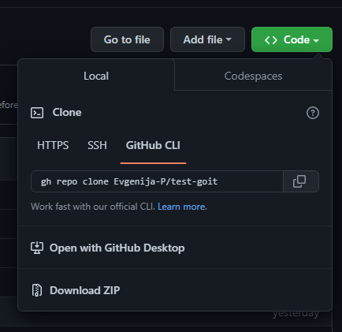
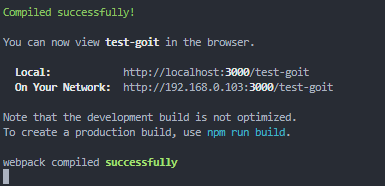

# Followers list

Этот проект был создан при помощи
[React homework template](https://github.com/goitacademy/react-homework-template).

## Начало работы:

Клонируйте репозиторий на свой компьютер. Теперь у Вас есть личный репозиторий
проекта, со структурой файлов и папок репозитория-шаблона. Д



алее работайте с ним как с любым другим личным репозиторием. Откройте папку с
репозиторием в удобном для Вас редакторе и установите зависимости. Для этого
достаточно просто выполнить команду `npm install` или `npm i`.

После этого можно запустить проект локально. Выполните коменту `npm start`.

Проект откроейт в браузере. По умолчанияю локальный адрес
[http://localhost:3000/test-goit](http://localhost:3000/test-goit). Cтраница
будет автоматически перезагружаться после сохранения изменений в файлах проекта.



## Деплой

Продакшн версия проекта будет автоматически проходить линтинг, собираться и
деплоиться на GitHub Pages, в ветку `gh-pages`, каждый раз когда обновляется
ветка `main`. Например, после прямого пуша или принятого пул-реквеста. Для этого
необходимо в файле `package.json` отредактировать поле `homepage`, заменив
`your_username` и `your_repo_name` на свои, и отправить изменения на GitHub.

```json
"homepage": "https://your_username.github.io/your_repo_name/"
```

Далее необходимо зайти в настройки GitHub-репозитория (`Settings` > `Pages`) и
выставить раздачу продакшн версии файлов из папки `/root` ветки `gh-pages`, если
это небыло сделано автоматически.


### Статус деплоя

Статус деплоя крайнего коммита отображается иконкой возле его идентификатора.

- **Желтый цвет** - выполняется сборка и деплой проекта.
- **Зеленый цвет** - деплой завершился успешно.
- **Красный цвет** - во время линтинга, сборки или деплоя произошла ошибка.

### Живая страница

Через какое-то время, обычно пару минут, живую страницу можно будет посмотреть
по адресу указанному в отредактированном свойстве `homepage`. Например, вот
ссылка на живую версию для этого репозитория
[https://evgenija-p.github.io/test-goit/](https://evgenija-p.github.io/test-goit/).
